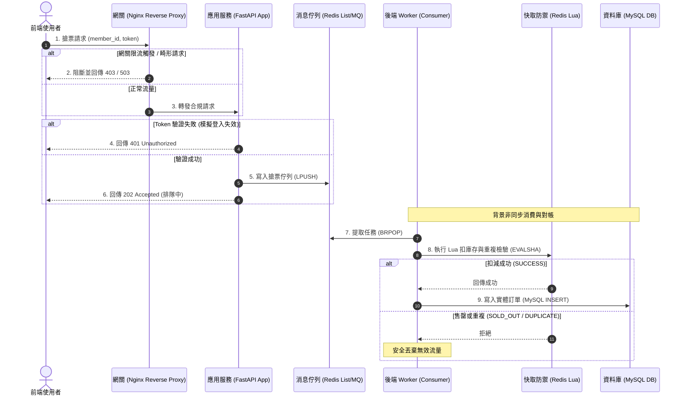
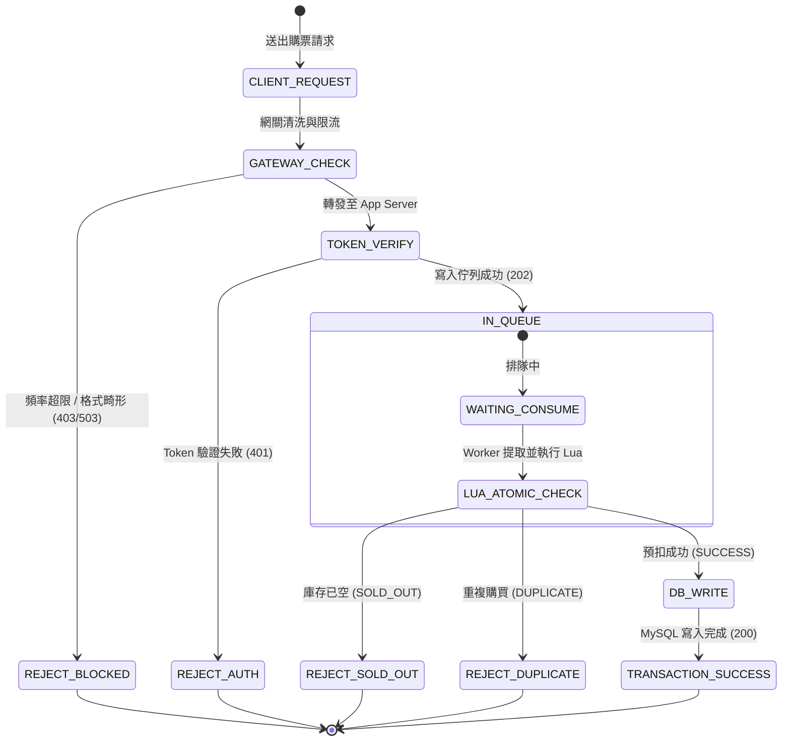

# Flow_Diagram.md: 邊緣防禦、流量佇列與交易落庫生命週期

## 1. 系統架構概覽 (System Architecture)
本系統透過「網關邊緣防禦」、「非同步佇列削峰」與「快取防禦原子扣減」實現高可靠的搶票交易流程。
- **流量路徑**: User -> Reverse Proxy Gateway (Nginx) -> App Server (FastAPI) -> Message Queue (Redis/RabbitMQ) -> Background Worker -> Redis (Lua Cache) & MySQL (DB)

---

## 2. 核心請求流程 (Request Sequence)

### A. Gateway 邊緣防禦與分流階段 (Gateway Ingress Phase)
1. **靜態與動態解耦**: 
   - 請求為靜態網頁（HTML/JS），由網關層在 OS Kernel 級別直接託管與快取回傳，流量不觸及後台。
   - 請求為搶票 API (`/api/v1/tickets/*`)，進入動態流量清洗。
2. **流量清洗與限流**: 
   - 網關依據客戶端特徵（如來源 IP）實作限流演算法（例如最大 2 r/s）。
   - 超過限流閾值者，網關直接阻斷並回傳 `403 Forbidden` 或 `503 Service Unavailable`。
3. **安全邊界預檢**: 
   - 過濾畸形請求，剔除長度不合規或格式錯誤之無效請求。

### B. App 驗證與入隊階段 (Application & Verification Phase)
1. **身份與交易驗證**:
   - App Server 接收請求，提取 `member_id` (int) 與 `token`。
   - 執行簡化的 Token 驗證。若驗證失敗（如 Token 無效、逾期），直接回傳 `401 Unauthorized`。
2. **排隊削峰**:
   - 驗證成功之合法請求，App 寫入排隊佇列 (MQ)。回傳 `202 Accepted`（前端進入排隊輪詢狀態）。

### C. Worker 消費與落庫階段 (Worker Consumption & Persistence Phase)
1. **異步消費**: Worker 執行緒從佇列中取出請求任務。
2. **快取防禦扣減 (Redis Lua)**: 
   - 呼叫預載入之 Lua 腳本進行原子操作：
     - **重複檢查**：檢查 `member_id` 是否已中獎，若已中獎回傳 `DUPLICATE_ORDER`。
     - **庫存檢查**：檢查剩餘庫存是否大於 0。若無庫存，回傳 `SOLD_OUT`。
     - **扣庫存與記錄**：若有庫存，扣減庫存並將中獎者寫入快取暫存表，回傳 `SUCCESS`。
3. **MySQL 落庫**: 
   - 僅當 Lua 回傳 `SUCCESS` 時，Worker 將訂單寫入 MySQL 資料庫，紀錄中獎的 `member_id`。
   - 若 Lua 回傳 `SOLD_OUT` 或 `DUPLICATE_ORDER`，則安全丟棄該無效請求。

---

## 3. 系統狀態矩陣 (System State Matrix)

| 狀態 (State) | 描述 | 後續行動 |
| :--- | :--- | :--- |
| **VALIDATING** | App 驗證 Token 中 | 成功則寫入佇列排隊；失敗回傳 401 拒絕。 |
| **QUEUEING** | 請求已寫入佇列削峰 | 前端輪詢，等待 Worker 處理。 |
| **PROCESSING** | Worker 提取請求並執行 Lua | 進行原子庫存扣減與重複性檢查。 |
| **SUCCESS** | 庫存預扣成功且寫入 MySQL | 產生正式購票成功憑證。 |
| **REJECTED** | 庫存已空、重複購買或驗證失敗 | 釋放資源，回傳售罄/重複/非法錯誤。 |

---

## 4. 異常防禦與冪等性 (Resilience)

1. **唯一性約束防重**:
   - 快取層使用 `ticket:success:orders` 雜湊表與 `ticket:user:event` 作為原子防重標記。
   - MySQL `orders` 表建立 `(member_id, event_id)` 的聯合唯一索引 (Unique Index)，在資料庫底層提供最終冪等防護。
2. **限流降級保護**:
   - 網關限流（Rate Limiting）阻斷 90% 以上惡意刷票與重複請求，保護應用伺服器不致因連線池爆滿而崩庫。
3. **對帳機制**:
   - 系統最終成交量必須與釋出票數完全吻合。可透過對帳程序比對 Redis 中獎名單與 MySQL 訂單紀錄。

---

## 5. Visual Logic Representations

### 5.1 系統循序圖 (Sequence Diagram)

### 5.2 交易狀態機 (Transaction State Diagram)

